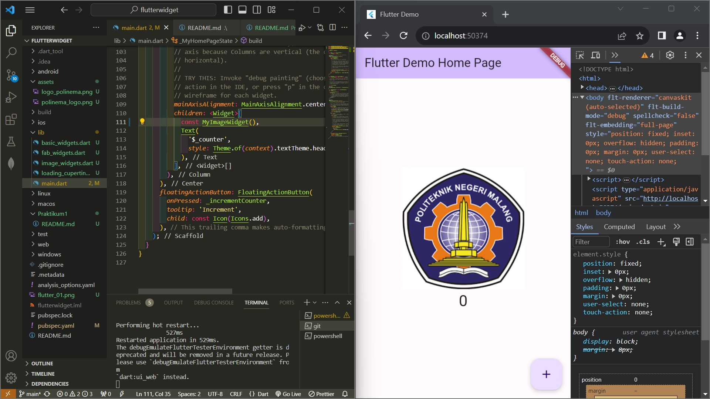
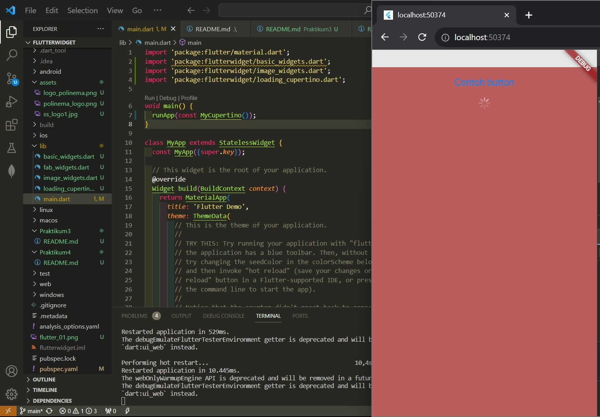
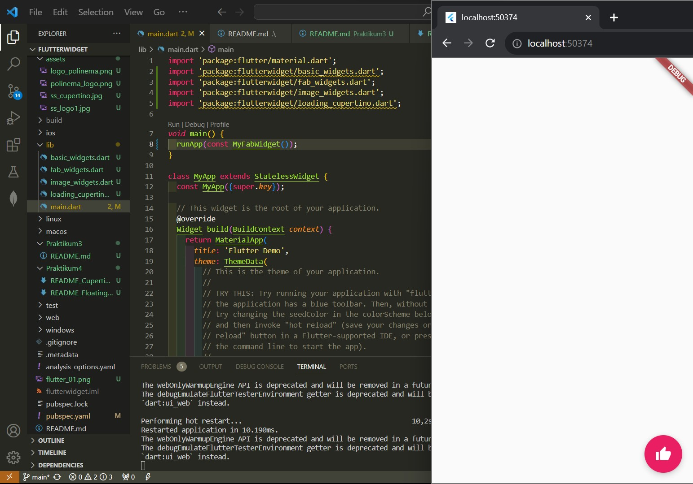
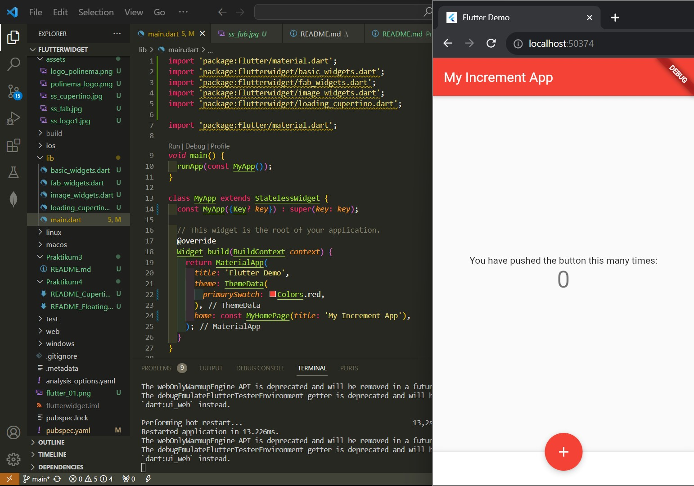
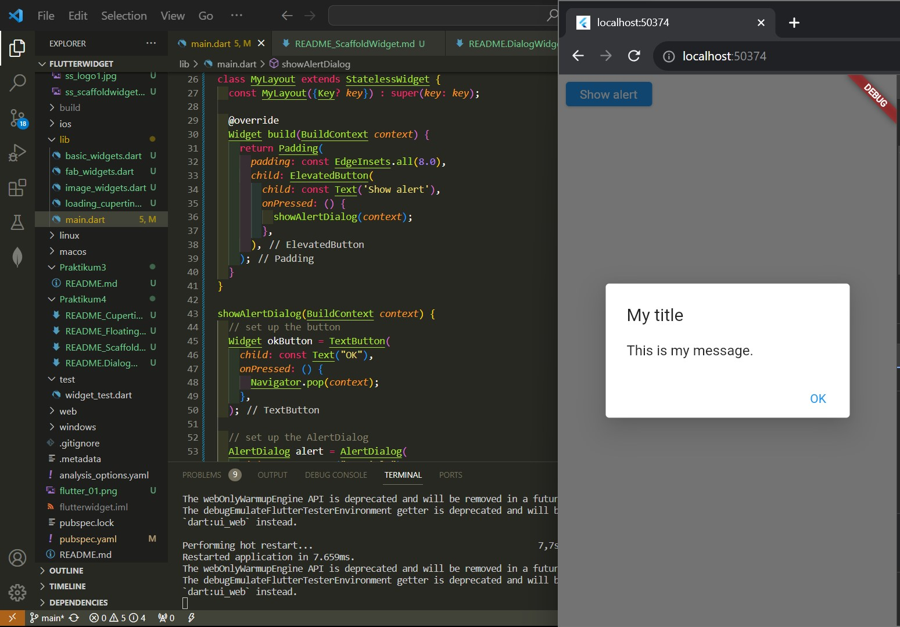
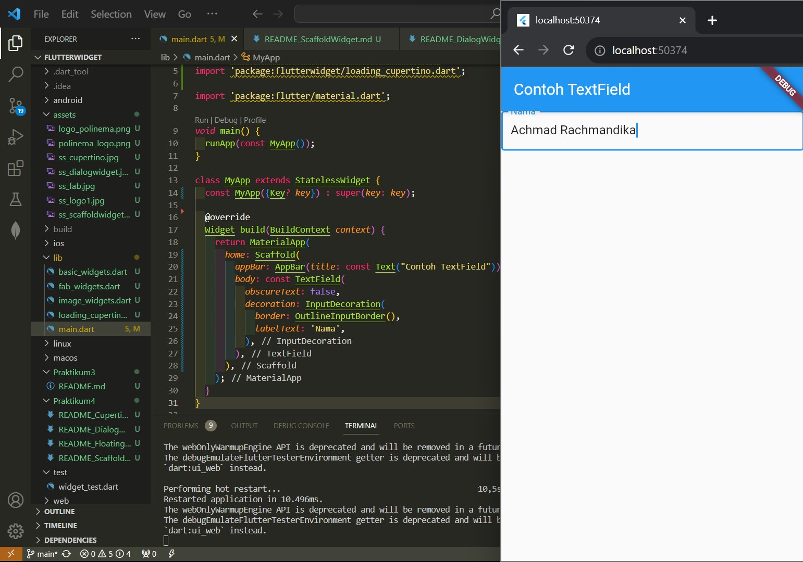
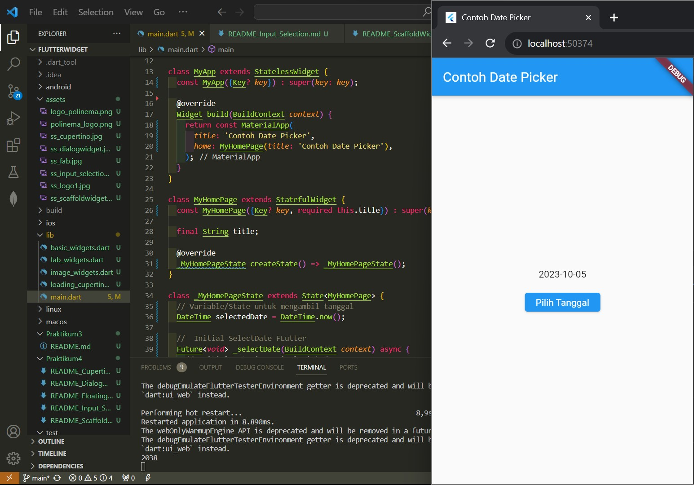
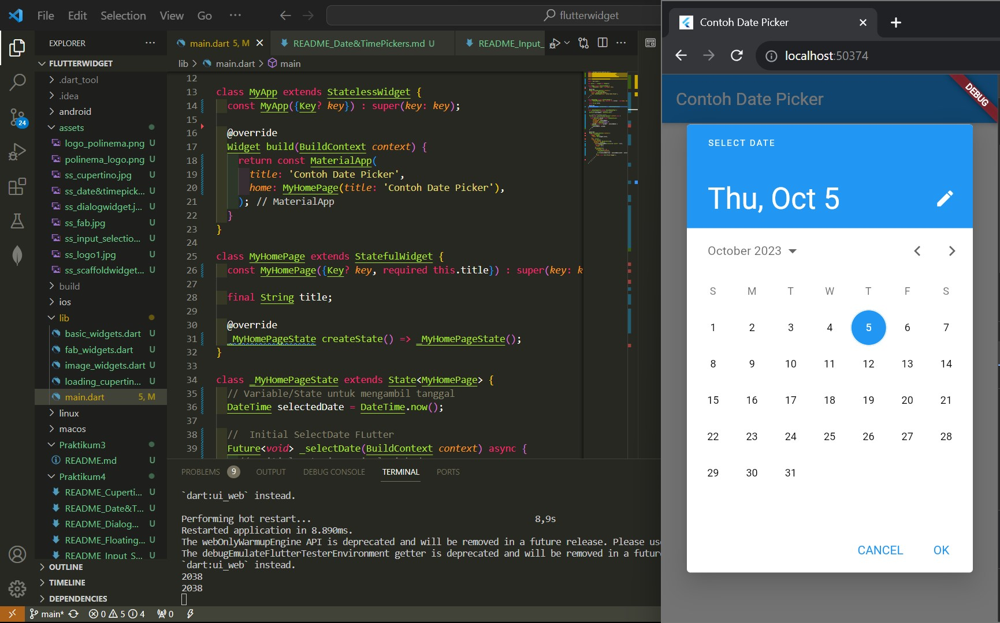

# Nama: Achmad Rachmandika Rizky Pratama

# Kelas: 3A

# NIM: 2041720125

<!-- This project is a starting point for a Flutter application.

A few resources to get you started if this is your first Flutter project:

- [Lab: Write your first Flutter app](https://docs.flutter.dev/get-started/codelab)
- [Cookbook: Useful Flutter samples](https://docs.flutter.dev/cookbook)

For help getting started with Flutter development, view the
[online documentation](https://docs.flutter.dev/), which offers tutorials,
samples, guidance on mobile development, and a full API reference. -->

# Logo Polinema

Logo Polinema

# Cupertino

Contoh Loading dan Button

# FloatingActionButton

Mucul button

# Scaffold Widget

Scaffold WIdget

# Dialog Widget

Muncul Alert

# Input dan Selection Widget

Textfield yang bisa di isi

# Date and Time Pickers

A new flutter project

